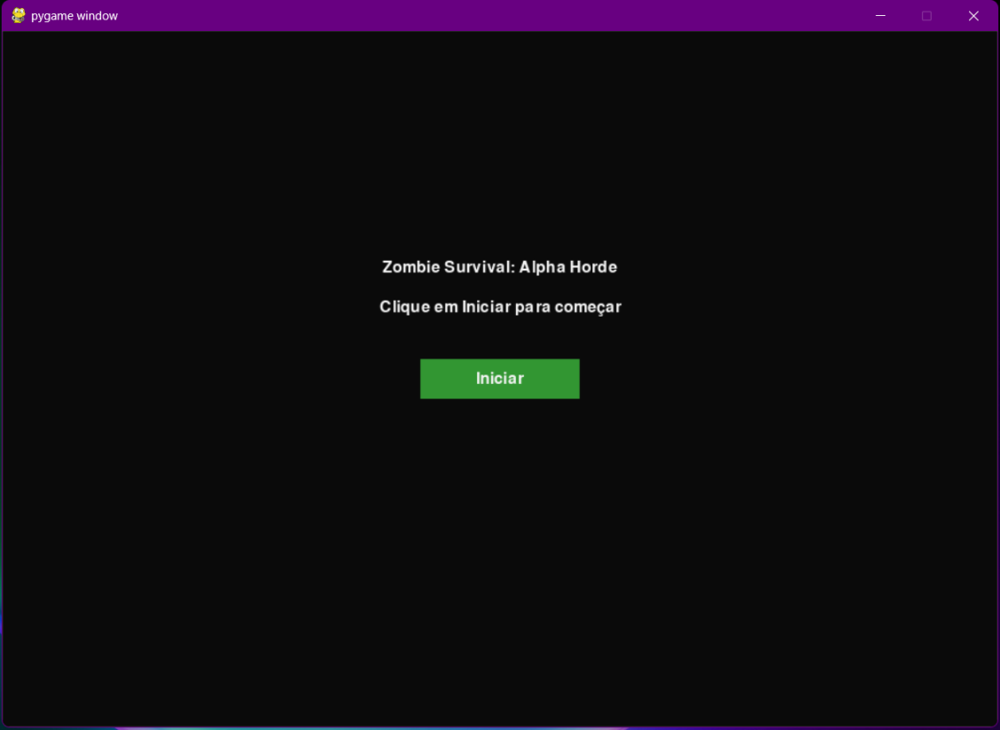
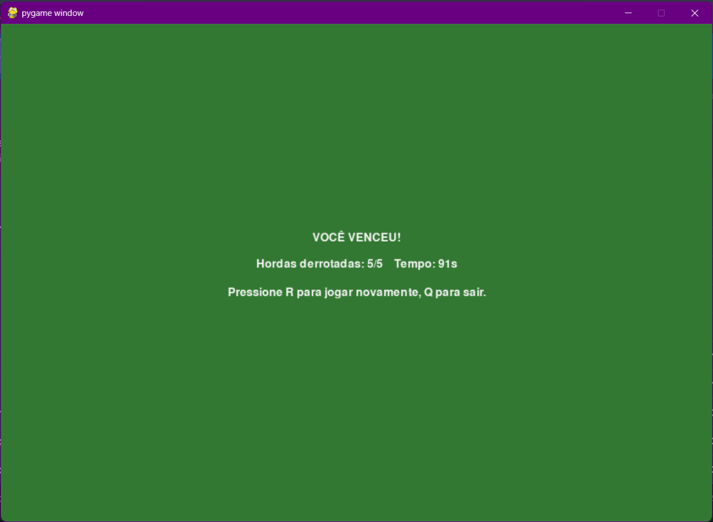

# Zombie Survival: Alpha Horde

Número da Lista: 22<br>
Conteúdo da Disciplina: Algoritmos de Dividir e Conquistar<br>

## Alunos

| Matrícula | Aluno                            |
| --------- | -------------------------------- |
| 211061903 | Isaque Santos                    |
| 200023985 | Maria Eduarda dos Santos Marques |

## Sobre

Este projeto tem como objetivo demonstrar algoritmos de dividir-e-conquistar dentro de um jogo, onde hordas de zumbis se formam e um zumbi Alfa é selecionado em cada grupo. O objetivo é mostrar visualmente como algoritmos de agrupamento e seleção influenciam comportamento coletivo.

O problema-modelo considera:

- Zumbis com atributos variados (força, velocidade)
- Distância entre zumbis (para definir agrupamentos)
- Seleção de um líder (Zumbi Alpha) que confere bônus ao grupo
- Métricas simples de comportamento da horda (tamanho, força média)

A solução foi construída utilizando:

- Implementações manuais dos algoritmos de divisão-e-conquista mostrados no código
- Interface gráfica com PyGame para visualização em tempo real

O jogo funciona organizando as hordas e aplicando a seleção do Alpha da seguinte forma:

- Cada zumbi possui atributos como posição, força e velocidade
- Zumbis próximos são agrupados usando uma abordagem baseada em Closest Pair
- Para cada grupo, a Mediana das Medianas é usada para escolher um Alpha sem ordenar a lista inteira
- O Alpha altera atributos do grupo (por exemplo, força/velocidade) e o jogo mostra o efeito em tempo real

## Algoritmos utilizados

O sistema aplica, de forma adaptada ao jogo:

- Closest Pair of Points — para identificar e unir zumbis próximos, formando grupos/hordas de forma eficiente.
- Mediana das Medianas — para selecionar o zumbi Alpha (k-ésimo elemento) de cada horda sem ordenar toda a lista, garantindo tempo linear no pior caso.

## Screenshots

# Tela inicial


# Tela de execução 


# Tela de vitória


# Tela de derrota


## Vídeo do trabalho

## Instalação

Como executar:

1. Instale dependências:

```bash
pip install -r requirements.txt
```

2. Rode o jogo:

```bash
python main.py
```

Controles rápidos:
- Movimento: `WASD`
- Atirar: clique do mouse

Objetivo pedagógico:
- Permitir que alunos e curiosos vejam, brinquem e modifiquem os algoritmos para entender o impacto de decisões algorítmicas em sistemas dinâmicos.